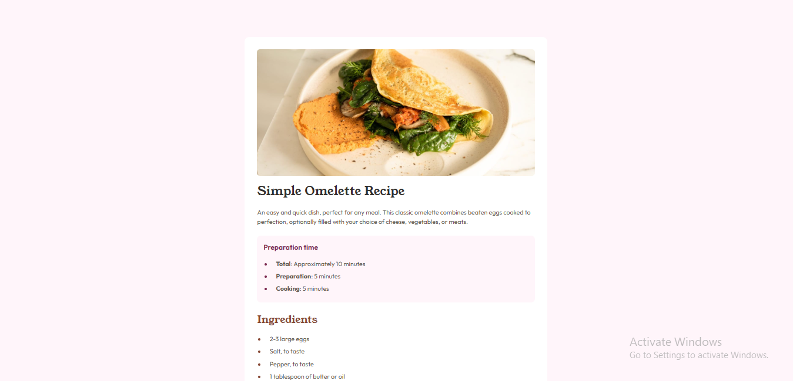

# Frontend Mentor - Recipe page solution

This is a solution to the [Recipe page challenge on Frontend Mentor](https://www.frontendmentor.io/challenges/recipe-page-KiTsR8QQKm). Frontend Mentor challenges help you improve your coding skills by building realistic projects.

## Table of contents

- [Overview](#overview)
  - [Screenshot](#screenshot)
  - [Links](#links)
- [My process](#my-process)
  - [Built with](#built-with)
  - [What I learned](#what-i-learned)
  - [Continued development](#continued-development)
  - [Useful resources](#useful-resources)
- [Author](#author)
- [Acknowledgments](#acknowledgments)

## Overview

### Screenshot



### Links

- Solution URL: [Adektivity](https://github.com/adektivity/recipe-website)
- Live Site URL: [Recipe Page](https://adektivity.github.io/recipe-website/)

## My process

### Built with

- Semantic HTML5 markup
- CSS custom properties
- CSS Grid
- Mobile-first workflow

### What I learned

I learned how to implement a professional website according to the stated design and specification. I also improved on responsive website design with the use breakpoints for different screen sizes. There was also a lot of frustrations and tears figuring out table design in css.

```html
<table class="nutrition-table">
  <tr>
    <td>Calories</td>
    <td class="nutrition-data">277kcal</td>
  </tr>
  <tr>
    <td>Carbs</td>
    <td class="nutrition-data">0g</td>
  </tr>
  <tr>
    <td>Protein</td>
    <td class="nutrition-data">20g</td>
  </tr>
  <tr>
    <td>Fat</td>
    <td class="nutrition-data">22g</td>
  </tr>
</table>
```

```css
.nutrition-table {
  width: 100%;
  border-collapse: collapse;
  margin-bottom: 1rem;
}

.nutrition-table tr {
  border-bottom: 1px solid var(--hr-color);
}

.nutrition-table td {
  padding: 10px 0;
  font-size: 1rem;
}
```

### Continued development

I'd like to develop this further into something that's more of a recipe sharing website for me and my friends.

### Useful resources

- [W3Schools](https://www.w3schools.com) - This helped me with mordern css styles for tables and lists. I'd recommend to anyone having issues styling tables.
- [Youtube](https://www.youtube.com) - Youtube helped me with a refresher on git commands. I'd recommend it to anyone still learning this concept.

## Author

- Github - [Adektivity](https://github.com/adektivity)
- Frontend Mentor - [@adektivity](https://www.frontendmentor.io/profile/adektivity)
- Twitter - [@AdeksonDev](https://x.com/AdeksonDev)

## Acknowledgments

To everyone out there who keeps adding and updating resources online to enable anyone to learn for free. Thank you all😉❤.
